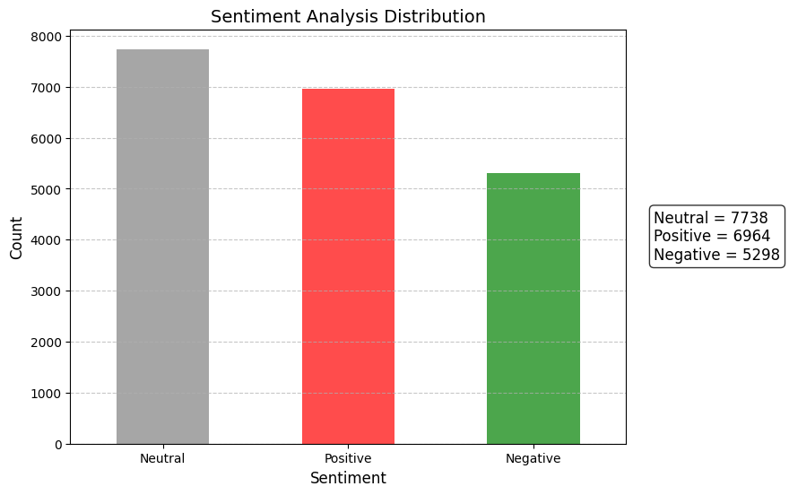

# Meme Sentiment Analysis

## Overview

The Meme Sentiment Analysis project processes multilingual memes, including Filipino/Tagalog, by extracting, translating, and analyzing text from images, and combining it with auto-generated captions for sentiment analysis. The results are stored and visualized for further insights, providing valuable data for social media trends and audience behavior analysis.

## Features

1. **Image Caption Generation**
   - Utilizes a pre-trained BLIP model to generate captions for images accurately.
2. **Text Extraction**
   - Uses EasyOCR with support for English and Tagalog (Filipino), ensuring accurate text extraction from memes.
3. **Text Translation**
   - Employs Google Translate to seamlessly translate extracted text into English for analysis.
4. **Sentiment Analysis**
   - Leverages VADER Sentiment Analysis to evaluate the sentiments of captions and translated texts.
5. **Data Storage and Visualization**
   - Saves analysis results in an Excel file with autofit columns for readability.
   - Generates sentiment distribution bar graphs for visualization.
6. **Parallel Processing**
   - Processes multiple images concurrently to optimize time efficiency.
7. **Error Handling and GPU Optimization**
   - Retries processing when GPU memory issues arise, ensuring consistent results.

## Workflow

1. **Input Options**
   - Option to process a single image or an entire folder of images.
2. **Image Processing**
   - Extracts text from images using OCR.
   - Translates the extracted text to English for consistency.
   - Analyzes the sentiment of both the translated text and generated captions.
3. **Result Compilation**
   - Combines the analyzed sentiments into an overall sentiment score.
   - Calculates a confidence level for the sentiment analysis results.
   - Saves results into an Excel file and adjusts column widths for optimal display.
4. **Visualization**
   - Creates sentiment distribution charts for visual representation of data.

## Scraping Memes with `scrape.py`

The `scrape.py` script in the `Scraper` folder plays a vital role in downloading large datasets of memes from Google Images. This script is designed to:

1. **Search and Collect Memes**

   - Automates the process of searching for memes on Google Images using specified keywords.
   - Handles pagination to scrape multiple pages of results efficiently.

2. **Download Images**

   - Downloads images directly to a specified folder, ensuring they are organized for subsequent analysis.

3. **Error Handling**
   - Includes mechanisms to retry failed downloads and handle exceptions gracefully, ensuring a smooth scraping process.

### How It Works

- **Input Keywords**: The script takes input keywords to define the type of memes to search.
- **Web Scraping**: It uses libraries like `requests` and `BeautifulSoup` to fetch and parse web pages.
- **Image Downloading**: Extracted image links are downloaded and saved locally.
- **Batch Processing**: The script supports scraping large datasets by managing multiple requests and avoiding rate limits.

### Usage

To use the `scrape.py` script:

1. Navigate to the `Scraper` folder.
2. Run the script with your desired search keywords:
   ```bash
   python scrape.py --keywords "funny memes" --limit 100
   ```
   - Replace `"funny memes"` with your desired keywords.
   - Use the `--limit` option to specify the number of images to download.
3. The downloaded memes will be saved in a designated folder for further processing.

This script is an essential component for building extensive meme datasets, making it easier to analyze trends and sentiments in diverse meme collections.

## Bar Graph Generation

The `Bargraph_Generator.py` script generates a bar graph from the sentiment analysis results stored in the Excel file. This bar graph visually represents the distribution of sentiments (Positive, Neutral, Negative).

### Example Bar Graph

Below is an example of a generated bar graph:



## How to Use

1. Install the required dependencies using the `requirements.txt` file:
   ```bash
   pip install -r requirements.txt
   ```
2. Run the script using a terminal:
   ```bash
   python app.py
   ```
3. Choose the desired processing mode:
   - For a single image, input the image file path.
   - For a folder, input the directory path containing the images.
4. Outputs include:
   - Extracted and translated text.
   - Image captions.
   - Sentiment analysis results.
   - An Excel file with detailed data.

To generate a bar graph from the results, run the `Bargraph_Generator.py` script:

```bash
python Bargraph_Generator.py
```

## Prerequisites

- Python 3.8 or higher.
- NVIDIA GPU with CUDA support for optimal performance.
- Required Python libraries (see `requirements.txt`).

## Notes

- Before running the script, set the PyTorch CUDA environment variable:
  ```bash
  $env:PYTORCH_CUDA_ALLOC_CONF="expandable_segments:True"
  ```
- The project includes a retry mechanism to handle GPU memory issues dynamically.
- Sentiment confidence scores are adjusted to ensure accurate interpretation of results.

## Applications

- Social media sentiment analysis for trends and audience insights.
- Marketing campaigns for understanding customer reactions.
- Multilingual text sentiment evaluation.

## Limitations

- Dependence on OCR and translation quality may affect accuracy.
- GPU memory limitations could impact the processing of large datasets.

## File Outputs

- **Excel File**: `Sentiment_Analysis_Results.xlsx` in the output directory, containing detailed analysis data.
- **Charts**: Sentiment distribution bar graphs, providing visual summaries of sentiment trends.

## Future Enhancements

- Support for additional languages in OCR and translation.
- Improved handling of large datasets to minimize processing time.
- Enhanced visualization options for richer data insights.

## Contact

For questions, feedback, or contributions, contact Kenny Walter Diolola. Connect to explore further opportunities to refine and expand this project.
